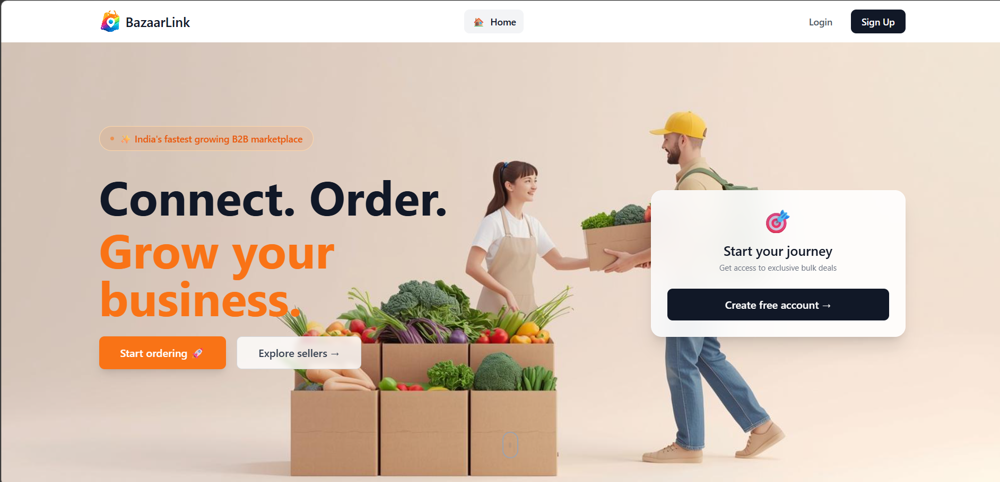

<div align="center">

# 🛒 BazaarLink

### 🚀 The Smart B2B Marketplace for Vendors & Sellers

<p>
  <strong>Find suppliers. Compare prices. Order in bulk — faster than ever.</strong>
</p>

<br/>

[](https://bazaar-link-mkz1.vercel.app/)
[](https://react.dev)
[](https://firebase.google.com)
[](LICENSE)

</div>

---

## 🧠 Problem

Local vendors still depend on:
- ❌ Phone calls  
- ❌ WhatsApp orders  
- ❌ Manual price comparison  
- ❌ Unorganized supplier networks  

This leads to **delays, higher costs, and inefficiency**.

---

## 💡 Solution — BazaarLink

BazaarLink is a **B2B bulk ordering marketplace** that connects **vendors with nearby sellers**.

It enables:
- ⚡ Faster sourcing  
- 💰 Better price comparison  
- 📍 Location-based discovery  
- 📦 Seamless bulk ordering  

---

## ✨ Key Features

### 🛒 Vendor Side
- Discover **nearby sellers using geolocation**
- Compare prices across multiple stores
- Place **bulk orders with multiple items**
- Track orders in real-time
- View order history & analytics

### 🏪 Seller Side
- Create and manage your store
- Add products with pricing & discounts
- Accept / reject incoming orders
- Manage inventory and requests
- Track performance via dashboard

---

## ⚙️ Tech Stack

| Layer | Technology |
|------|----------|
| Frontend | React 18 + Tailwind CSS |
| Routing | React Router DOM |
| Authentication | Firebase Auth |
| Database | Firestore (NoSQL) |
| Location | Geolocation API + Haversine |
| Notifications | React Hot Toast |
| Hosting | Vercel / Firebase |

---

## 🏗️ Architecture Overview

```

User (Vendor/Seller)
↓
React Frontend (UI + Logic)
↓
Firebase Auth (Authentication)
↓
Firestore Database (Users, Stores, Orders)

````

---

## 🚀 Getting Started

### 1. Clone repo

```bash
git clone https://github.com/yourusername/bazaarlink.git
cd bazaarlink
````

### 2. Install dependencies

```bash
npm install
```

### 3. Setup environment variables

Create `.env` file:

```env
VITE_FIREBASE_API_KEY=
VITE_FIREBASE_AUTH_DOMAIN=
VITE_FIREBASE_PROJECT_ID=
VITE_FIREBASE_STORAGE_BUCKET=
VITE_FIREBASE_MESSAGING_SENDER_ID=
VITE_FIREBASE_APP_ID=
```

### 4. Run locally

```bash
npm run dev
```

---

## 🔄 User Flow

### Vendor Flow

```
Signup → Browse Sellers → Compare Prices → Place Bulk Order → Track Delivery
```

### Seller Flow

```
Signup → Setup Store → Receive Orders → Accept/Reject → Fulfill Order
```

---

## 📂 Project Structure

```
src/
 ├── components/
 ├── pages/
 ├── hooks/
 ├── context/
 ├── firebase.js
 └── App.jsx
```

---

## 📈 Roadmap

### ✅ Completed

* Role-based authentication
* Bulk order system
* Nearby seller discovery
* Seller dashboard

### 🔄 In Progress

* Payment integration (Razorpay)
* Real-time notifications
* Chat between vendor & seller

### 🔮 Future

* Mobile app (React Native)
* AI price prediction
* Multi-language support
* Invoice generation

---

## 🌍 Impact

BazaarLink aims to:

* Empower **local vendors**
* Digitize **informal supply chains**
* Reduce **middlemen dependency**
* Improve **pricing transparency**

---

## 🤝 Contributing

```bash
git checkout -b feature/new-feature
git commit -m "feat: add new feature"
git push origin feature/new-feature
```

---

## 📄 License

MIT License © 2026 BazaarLink

---

<div align="center">

### 💙 Built for real-world vendors & small businesses

</div>
```


